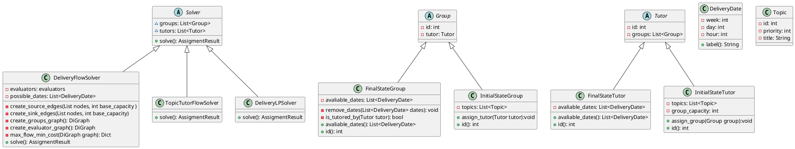

# Disennio posible de entidades y estructuras

El objetivo de este documento es alinear las diferentes entidades comunes que usa todo el equipo

## Diagramas de Clases

Diagrama de clases principales que sirven para la resolucion de los algoritmos

## Estructura del proyecto
