# Diseño posible de entidades y estructuras

El objetivo de este documento es alinear las diferentes entidades comunes que usa todo el equipo


## Diagramas de Clases

Diagrama de clases principales que sirven para la resolucion de los algoritmos

```plantuml
@startuml
class DeliveryDate {
- week: int
- day: int
- hour: int
+ label(): String
}

class Tutor {
- id: int
- name: String
- email: String
- groups: List[Group]
+ assign_group(group: Group): None
}

class FinalStateTutor {
- id: int
- available_dates: List[DeliveryDate]
- assigned_dates: List[DeliveryDate]
}

Tutor *-right- FinalStateTutor

class Group {
- id: int
- tutor: Tutor
+ assign_date(date: DeliveryDate)
+ assigned_date(): DeliveryDate
+ available_dates(): List[DeliveryDate]
+ add_available_dates(dates: List[DeliveryDate]): None
+ remove_dates(dates: List[DeliveryDate]): None
+ filter_dates(dates: List[DeliveryDate]): List[DeliveryDate]
}

class FinalStateGroup {
- available_dates: List[DeliveryDate]
- assigned_date: DeliveryDate
- remove_dates(dates: List[DeliveryDate]): None
- assign_date(date: DeliveryDate): None
+ available_dates(): List[DeliveryDate]
}

Group *-right- FinalStateGroup

class AssigmentResult {
- groups: List[Group]
- evaluators: List[Evaluator]
+ delivery_date_group(group: Group): DeliveryDate
+ delivery_dates_evaluator(evaluator: Evaluator): List[DeliveryDate]
}

abstract class DeliverySolver {
- available_dates: List<DeliveryDate>
+ solve(): AssigmentResult
}

abstract class OutputFormatter {
+ create_formatter(result_type: Union[dict, list]): Union[FlowOutputFormatter, LPOutputFormatter]
+ format_result(result: Union[Dict, List], groups: List[Group], evaluators: List[Evaluator])
}

DeliverySolver o-up-OutputFormatter

class FlowOutputFormatter {
+ get_result(result: Dict, groups: List[Group], evaluators: List[Evaluator]): AssigmentResult
}

class LPOutputFormatter {
+ get_result(result: Dict, groups: List[Group], evaluators: List[Evaluator]): AssigmentResult
}

class DeliveryFlowSolver extends DeliverySolver {
- evaluators: List[Evaluator]
- possible_dates: List[DeliveryDate]
- create_groups_graph(): DiGraph
- create_evaluator_graph(): DiGraph
- max_flow_min_cost(graph: DiGraph): Dict
+ solve(): AssigmentResult 
}

class DeliveryLPSolver extends DeliverySolver {
+ solve(): AssignmentResult 
}
@enduml
```



## Estructura del proyecto
```
assignment-service/
├── pyproject.toml
├── poetry.lock
├── README.md
├── .gitignore
├── 
├── src/
│   └── assignments/
│       ├── __init__.py
│       └── date/
│         ├── lp/
│             ├── delivery_evaluators_lp_solver.py
│             ├── delivery_lp_solver.py
│             ├── delivery_tutors_lp_solver.py
│         ├── delivery_flow_solver.py
│         ├── delivery_solver.py
│       └── topic_tutor/
│   └── io/
│       ├── output/
│             ├── output_formatter.py
│             ├── flow_output_formatter.py
│             ├── lp_formatter.py
│       ├── input_formatter.py
│   └── model/
│       ├── group/
│             ├── group.py
│             ├── final_state_group.py
│       ├── tutor/
│             ├── tutor.py
│             ├── final_state_tutor.py
│       └── utils/
│         ├── delivery_date.py
│         ├── evaluator.py
│         ├── topic.py
│         ├── result.py
│   └── constants.py
│   └── exceptions.py
│── tests/
│   └── assignments/
│       └── date/
│         ├── delivery_flow_solver_test.py
│         ├── delivery_lp_solver_test.py
│         ├──helper.py
│       └── topic_tutor/
│   └── io/
│       ├── output/
│             ├── output_formatter.py
│             ├── flow_output_formatter.py
│             ├── lp_formatter.py
│       ├── input_formatter.py
│   └── model/
│         ├── evaluator_test.py
```
## Possible Folder Structure


