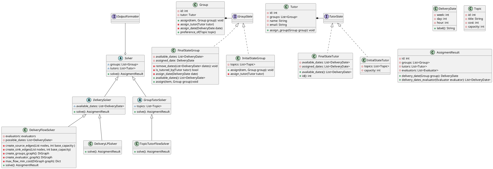

# Diseño posible de entidades y estructuras

El objetivo de este documento es alinear las diferentes entidades comunes que usa todo el equipo


## Diagramas de Clases

Diagrama de clases principales que sirven para la resolucion de los algoritmos



## Estructura del proyecto

```
assignment-service/
├── pyproject.toml
├── poetry.lock
├── README.md
├── .gitignore
├── 
├── src/
│   └── algorithms/
│       ├── __init__.py
│       └── ...
│   └── model/
│       ├── group/
│       ├── tutor/
│       └── utils/
│         ├── delivery_date/
│         ├── evaluator.py
│         ├── topic.py
│── tests/
│   ├── __init__.py
│   └── ...
    
```
## Possible Folder Structure


